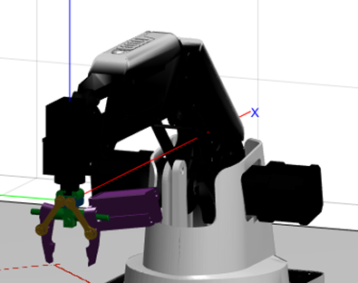

# SenConDobot

## About

This repo contains the Sorting Dobot project where a Dobot and a RGBD Camera is used in conjunction to sense coloured blocks and moves them into their designated zone.  

_This project was worked on as a part of UTS 41014 Sensors and Control - Dobot Project._

## Getting Started

To connect and set up the DoBot follow the steps here https://github.com/gapaul/dobot_magician_driver/wiki

To launch the DoBot drivers use the following command:
roslaunch dobot_magician_driver dobot_magician.launch

Open Matlab and run Peter Corkes Robotic Toolbox. The download can be found here: https://petercorke.com/toolboxes/robotics-toolbox/

## Basic Usage

Open 'RealRobotMain.m' as well as run the robotics toolbox.
Set up your environment with red, green and blue cubes that are no more than 20mm^3.
Run 'RealRobotMain.m

## License

Distributed under the Apache 2.0 License. See `LICENSE.txt` for more information.

## Contact

Aidan Korpar - 14251971 - aidan.j.korpar@student.uts.edu.au

Connor Fitzgibbon - 14272165 - connor.k.fitzgibbon@student.uts.edu.au

Johnson Ly - 14172391 - johnson.ly@student.uts.edu.au

(<a href="#readme-top">back to top</a>)

